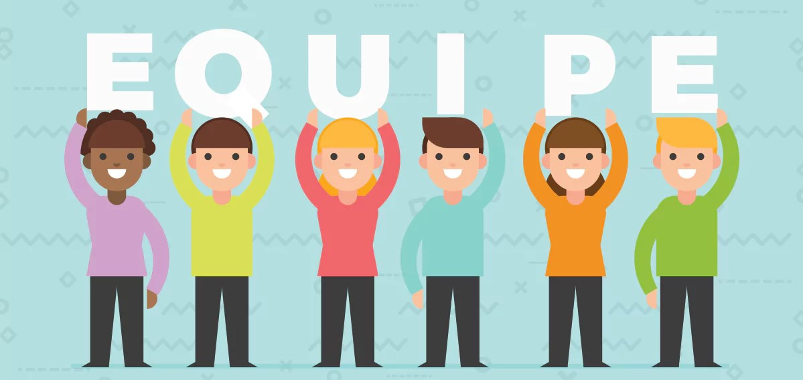

```{r setup, include = FALSE}
options(
  htmltools.dir.version  = FALSE,
  htmltools.preserve.raw = FALSE # needed for windows
)
```
class: inverse, middle, center
# O que é ser produtivo pra você?

<hr />

---

# Mais Rápido e Melhor

--

## Introdução

No livro Mais rápido e melhor, Charles Duhigg nos apresenta oito conceitos chave que explicam por que algumas pessoas e empresas são tão produtivas. São eles:


--
- Motivação</br>

--
- **Equipes**</br>

--
- Foco</br>

--
- Determinação e metas</br>

--
- Gestão de pessoas</br>

--
- Tomada de decisão</br>

--
- Inovação</br>

--
- Absorção de dados.</br>

--


``` r
Pergunta <- "Qual a fórmula para o sucesso de uma Equipe?"
```
--

É o que vamos discutir nos próximos slides, __confiram__...

---

class: inverse, middle, center
# Julia, e os gênios indomáveis de Yale

<hr />

---
# Mais Rápido e Melhor

--
.pull-left[
## Mudar é preciso
----


* Aos 25 anos, Julia Rozovsky, formada em matemática e economia, se viu insatisfeita com a carreira de consultora e descidiu que era hora de mudar.

* Ao entror para o MBA em Yale, diposta a fazer bons amigos com seu grupo de estudos, em pouco tempo, percebeu que seus colegas, eram ótimos em suas hábilidades mas o grupo não se entrosava, pois todos queriam de alguma forma sempre provar aos demais sua liderança e superioridade.


]
--

.pull-right[


]

---

class: inverse, middle, center
# Porque algumas pessoas não conseguem gerar bons resultados em equipe, mesmo possuindo experiências bem semelhantes?

<hr />


---
# Mais Rápido e Melhor

.pull-left[
## Estudos de casos
----

* Julia se inscreveu nos estudos de casos. Este novo grupo era diversificado, com pessoas vindo de experiências diferentes.

* Mesmo muito experiêntes, cada um tinha o seu espaço e conseguia expor suas ideias, que torna o grupo uma equipe de verdade.

* Os laços com o grupo de estudos de casos permanecem após o fim do curso.

]
--

.pull-right[



]

---

class: inverse, middle, center
# Google e os dados: O Projeto Aristóteles

<hr />


---
# Mais Rápido e Melhor

--

.pull-left[
## People Analytics
----

* Depois de formada, Julia entra para o Google onde passou a trabalhar com people analytics - usando dados para entender o comportamento dos funcionários da empresa.

* **"O todo é maior do que a soma de suas partes"** </br></br>
Essa foi a ideia que inspirou a criação do **Projeto Aristóteles** - com a prerrogativa de que os trabalhadores podem fazer mais trabalhando juntos do que isoladamente.

]


.pull-right[


]


---
# Mais Rápido e Melhor

## Projeto Oxigênio
----
.pull-left[

* O projeto anterior, **"Projeto Oxigênio"**, havia analisado a liderança, mas não tinha se concentrado na maneira como as equipes funcionam ou se havia uma mistura ótima de tipos de pessoas e formações.

]


.pull-right[ 
]
---

class: inverse, middle, center
# Julia pesquisando sobre normas de comportamento, encontrou os artigos de __Amy Edmondson,__ que falava sobre a **"Segurança Psicológica"** .

<hr />

---
# Mais Rápido e Melhor

<iframe width="720" height="460" src="https://www.youtube.com/embed/XX3U2D9yjro" title="Como criar segurança psicológica no trabalho - Amy Edmondson" frameborder="0" allow="accelerometer; autoplay; clipboard-write; encrypted-media; gyroscope; picture-in-picture" allowfullscreen></iframe>


### Como criar segurança psicológica no trabalho - Amy Edmondson
----

---

class: center, center, inverse

## O Projeto concluiu que, a **maneira como o grupo interage** é mais importante do que **quem está no grupo**. O caminho para a segurança psicológia começa no **líder da equipe**.


---

class: center, center, inverse

## Dois fatores são muito importantes para a construção de um ambiente de segurança psicológica dentro de uma organização: a **IGUALDADE DE TEMPO** que as pessoas passam se expressando e a **ESCUTA ATIVA** do líder.

## O sentimento de pertencimento faz com que as equipes trabalhem em harmonia e obtenham mais sucesso.


---

background-image: url(img/livro.jpg)
<!-- background-position: 10% 10% 10% 100% -->
background-size: 103%


